<!-- HERO SECTION (No tables! Floated fluid image for perfect PC/Mobile responsiveness) -->

### About Me
- 🌱 Full-Stack Web Developer focused on building **scalable, production-ready** web applications
- 💻 I work across **frontend, backend, databases & cloud platforms** with a strong interest in clean architecture and real-world systems
- ☁️ Currently diving deeper into **cloud-native architectures**, system design, and performance optimization
- 🎧 Massive **Alan Walker** fan. Creativity and music fuel the tech journey
- 📫 Feel free to reach out on **[Email](mailto:pritamwork1603@gmail.com)**

 

 

<h2 align="center"> Tech Stack</h2>

  
  
  
  
  
  
  
  
  
  
  
   
  
  
  
  
  
  
  
  
  
  
  
  
  

 

<h2 align="center"> GitHub Analytics</h2>

  

 

 

<h2 align="center"> GitHub Trophies</h2>

 
 

 

